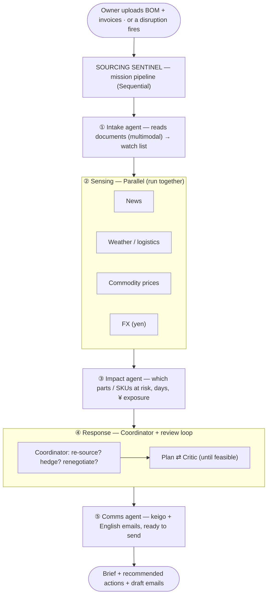

# Case Study — Sourcing Sentinel
### An agentic supply-chain risk radar for Japan's small manufacturers

*Prepared for the Google Japan × AI Builders Gemini AI Hackathon (I/O 2026 stack)*

---

## Executive summary

Japan's economy is built on small manufacturers, yet the firms least equipped to absorb shocks are the ones most exposed to them. A typhoon near a single supplier, a sudden yen slide, or a spike in a raw-material price can erase a small manufacturer's margin before its owner even hears the news — because that owner is also the salesperson, the bookkeeper, and the production manager, with no procurement team watching the horizon.

**Sourcing Sentinel** is a multi-agent AI system that gives a small manufacturer the equivalent of a 24/7 risk desk. It reads the company's real paperwork (bills of materials, supplier invoices), continuously watches the news, weather, commodity, and currency signals that threaten *its specific suppliers and parts*, quantifies the financial exposure, and hands the owner a ranked mitigation plan plus a ready-to-send, correctly formatted email. The goal is simple: turn "found out too late" into "acted a day early."

---

## 1. Background

### 1.1 Small manufacturers are the backbone of the Japanese economy
Small and medium-sized enterprises (SMEs) make up **99.7% of all enterprises in Japan — roughly 3.36 million companies** (Small and Medium Enterprise Support, Japan / SMRJ). Small businesses alone account for **84.5%** of enterprises (Meiji University). This is not a story about corner shops: very small firms — many with four or fewer employees — make up around **60% of the manufacturing sector** (Meiji University, citing the Economic Census). The average SME employs only about **10 people** (SME Agency, 2023 Basic Survey).

These are the *monozukuri* ("the art of making things") firms — precision parts, specialty components, machined metal, specialty foods, small electronics — that supply the larger brands and, in many cases, sit at the quiet center of global supply chains.

### 1.2 They run lean, and that is exactly the problem
A 10-person manufacturer does not have a procurement department, a risk officer, or a treasury desk. Sourcing decisions are made by the owner, often from long relationships with a **handful of suppliers, frequently single-sourced** for any given part. That concentration is efficient in calm conditions and dangerous when conditions change.

### 1.3 Conditions have not been calm
Three pressures have stacked up on precisely these firms:

- **A historically weak yen.** Between January 2021 and June 2024 the yen depreciated **more than 50% against the US dollar**, touching roughly **¥161.5 per dollar in July 2024 — its weakest since 1990** (RIETI / East Asia Forum; Business Review at Berkeley). For a manufacturer that imports materials or components priced in dollars, every slide in the yen raises input costs directly.
- **Margin compression that hits the small hardest.** A weak yen pushes up producer (input) prices faster than firms can raise their own prices, and **SMEs have less pricing power than large firms, so they absorb more of the hit** (RIETI; AMRO). One research estimate projected the weak yen would *lift* large-company profits but *cut* small-company (¥10–100M capital) ordinary profits by about **1.3%** — with a warning that excessive depreciation could push otherwise-viable firms out of business (Mizuho Research, via Kavout).
- **Supply-chain shocks as the new normal.** The war in Ukraine drove up material and energy costs and worsened component shortages such as semiconductors, underlining how exposed manufacturers are to events far outside their control (JETRO). Layered on top is Japan's standing exposure to natural disasters — typhoons and earthquakes that can take a regional supplier offline with little warning.

The result: the firms that are **most numerous, most strategically important, and least resourced** are operating in the **most volatile input environment in a generation.**

---

## 2. The problem and its pain points

> **Core problem:** Small Japanese manufacturers carry concentrated, single-sourced supply risk but have no capacity to monitor or act on it — so disruptions are discovered late, priced in pain, and met with a scramble.

The pain breaks down into five concrete points:

1. **Late detection.** Risk signals are scattered across news sites, weather feeds, commodity tickers, and FX screens. No owner has time to watch them daily, so the first sign of trouble is usually a late shipment or a surprise invoice.
2. **No translation from signal to *self*.** Even when an owner sees "typhoon approaching Kyushu," nobody computes *what that means for my parts, my products, and my margin this month.* Generic news is not decision-ready.
3. **No ready alternative.** Single-sourcing means that when a supplier wobbles, there is no pre-vetted backup, and finding one under time pressure is slow and error-prone.
4. **The paperwork tax.** Acting requires drafting careful supplier communications. In Japan that means correct **keigo** (formal honorific language) and, increasingly, bilingual correspondence — friction that delays action precisely when speed matters.
5. **Cost of inaction is asymmetric.** A day's early warning can mean a hedge, a pre-order, or an alternate locked in. A day late can mean a blown delivery, a penalty, or a lost customer. For a thin-margin SME, that asymmetry is existential.

### Illustrative scenario
*Tanaka Seiko* is a 22-person shop in Kagoshima that machines titanium bolts for four of a customer's product lines. A typhoon is tracking toward Kyushu; at the same time the yen weakens 3% and titanium prices rise 8%. The owner, busy on the shop floor, learns of the delay three days later from an apologetic phone call — after the price increase is already locked and the alternate suppliers are quoting long lead times. The disruption was knowable on day zero. Nothing connected the dots in time.

---

## 3. The proposed solution: Sourcing Sentinel

Sourcing Sentinel gives that owner the risk desk they cannot afford to hire — as a team of cooperating AI agents rather than a dashboard of raw data. Its design principle is **"action, not anxiety":** every run ends in a concrete, prioritized recommendation and a draft the owner can send in one click.

What makes it more than a chatbot is **specialization and parallelism.** Watching four very different risk streams, fusing them against a specific company's parts, and producing a vetted plan is not one task — it is several, each best handled by a focused expert. Sourcing Sentinel runs a small **fleet of specialist agents**, each with its own context, coordinated into a single answer.

---

## 4. Solution description

### 4.1 Input

**A. One-time setup — the company's own documents (multimodal).**
The owner uploads what they already have: a **Bill of Materials** (PDF, spreadsheet, or even a photo of one) and a **supplier invoice or two**. The system reads these directly — no clean database, no manual re-keying — and builds a structured **watch list**: each part, its supplier, the supplier's region, the buying currency, quantities, unit cost, lead time, and which finished products depend on it. This is where multimodal understanding earns its place: the input is messy, human paperwork, and the system meets it where it is.

**B. Continuous sensing — the outside world, monitored automatically.**
Against that watch list, the system pulls four independent signal streams on a schedule:
- **News** near each supplier and region (shutdowns, fires, strikes, insolvency).
- **Weather and logistics** (typhoons, port closures, shipping delays on relevant lanes).
- **Commodity prices** for the specific raw materials in the company's parts.
- **Foreign exchange**, tracking the yen against each currency the company buys in.

### 4.2 Process

The work flows through five stages, each mapped to an established agent-orchestration pattern:

1. **Intake (multimodal).** A document agent converts the uploaded BOM and invoices into the structured watch list.
2. **Sensing — *parallel*.** Four specialist agents (news, weather, commodity, FX) run **at the same time**, each producing a risk signal. Running them concurrently is faster and keeps each agent's reasoning focused and clean.
3. **Impact fusion — *sequential*.** An impact agent combines the four signals with the watch list to answer the only question that matters to the owner: *which of my parts and products are at risk, by how many days, and for how much money?* It outputs a risk score and an estimated yen exposure per affected part.
4. **Response — *coordinator + review loop*.** A coordinator agent reads the impact and decides which response fits the situation — re-source, hedge (buy ahead), or renegotiate. For re-sourcing it runs a **plan-and-critique loop**: a planner proposes alternate suppliers, and a critic rejects any that are too slow or impractical against the disruption's timeline, forcing a re-plan until the recommendation is genuinely feasible.
5. **Communication.** A comms agent drafts the needed emails — a status/expedite note to the incumbent supplier and, where relevant, a request-for-quote to the chosen alternate — in correct **keigo** with an English version alongside, ready to send.

The architecture, end to end:

### 4.3 Output

A single, decision-ready brief:
- **The alert** — what happened and which supplier/region it touches.
- **The impact** — the specific parts and finished products affected, estimated delay, and **estimated yen exposure** (illustratively: an affected part used across four product lines, with a quantified monthly exposure figure the owner can weigh instantly).
- **The plan** — ranked, *feasibility-checked* mitigation options (alternate supplier with rough price/lead-time/minimum order; or a hedge; or a renegotiation angle).
- **The action** — drafted, ready-to-send emails in keigo + English.

The owner moves from *unaware* to *acting* in the time it takes to read one screen.

---

## 5. Technology

Sourcing Sentinel is built entirely on the Google Cloud / Gemini agentic stack showcased at I/O 2026:
- **Gemini 3.5 Flash** as each agent's reasoning engine — fast enough that running several agents in parallel does not stack into long waits.
- **Agent Development Kit (ADK)** to define the agents and wire them into the parallel / sequential / loop / coordinator patterns above.
- **Multimodal document understanding** for BOM and invoice intake.
- **Search grounding** for live news and supplier discovery, with free public APIs for weather and FX.
- **Cloud Run** for deployment, exposing the system as a public web app.
- Optionally, **Antigravity 2.0** to schedule the sensing agents and visualize the fleet operating in real time.

The five-pattern, multi-agent design is also the system's defensibility: it is the same architecture shape that has won recent Google agent hackathons, because it visibly demonstrates orchestration rather than a single prompt.

---

## 6. Impact

### 6.1 For the individual manufacturer
- **Earlier action.** Disruptions surface as they emerge, not after they bite — converting a reactive scramble into a proactive decision.
- **Decision-ready clarity.** Risk is expressed in the owner's own terms — *my parts, my products, my yen* — instead of generic headlines.
- **Lower friction to act.** A vetted alternate and a ready-to-send keigo email remove the two biggest delays between knowing and doing.
- **Margin protection.** In an environment where a weak yen is already projected to *cut* small-firm profits, catching a single avoidable disruption or mis-timed purchase can be the difference between a profitable and an unprofitable month.

### 6.2 For the broader economy
Because SMEs are 99.7% of Japanese enterprises and a large share of manufacturing, tools that make these firms more resilient have outsized aggregate value. METI and JETRO have repeatedly stressed supply-chain strengthening as a national priority, and SMEs themselves show strong appetite for digitalization but lack the resources of large firms (JETRO). Sourcing Sentinel is, in effect, **enterprise-grade supply-chain risk management delivered at SME scale and cost** — exactly the kind of capability gap that AI is well-suited to close.

### 6.3 Strategic fit
The concept is **localized to Japan** in a way that is hard to fake: single-sourced *monozukuri* supply chains, yen-denominated import exposure, regional disaster risk, and keigo business correspondence. For a hackathon hosted with Google Japan, that local specificity is both the differentiator and the proof that the problem is real.

---

## 7. Honest limitations and risks

A credible case study names its weak points:
- **Alternate-supplier data is the hardest input.** Reliable, verified supplier databases are not freely available; an early version relies on search grounding plus a curated fallback list and should not overclaim a verified directory.
- **Estimates, not guarantees.** Yen-exposure and delay figures are decision aids, not audited forecasts; the system is designed to inform a human, never to act autonomously on procurement.
- **Signal quality varies.** News and commodity signals are noisier than FX and weather; the coordinator's job is to weigh, not blindly trust, each stream.
- **Adoption.** The value depends on the owner uploading a current BOM; keeping the watch list fresh is a real-world habit challenge, not a technical one.

These are scoping truths, not dealbreakers — and being explicit about them strengthens, rather than weakens, the proposal.

---

## 8. Future roadmap

- **Continuous monitoring** with scheduled background runs and push alerts (LINE / email) rather than on-demand checks.
- **Tier-2 supplier mapping** — risk often hides one layer below the direct supplier.
- **Learning the owner's thresholds** so alerting matches each firm's real risk appetite.
- **Verified supplier network** built over time into a genuine alternate-sourcing asset.
- **Sector templates** (food, precision metal, electronics) with tuned materials and signal sources.

---

## 9. Conclusion

Japan's small manufacturers are simultaneously essential and exposed: 3.36 million firms, the backbone of *monozukuri*, operating with lean teams in the most volatile input environment in decades. They do not need another dashboard — they need something that watches the horizon for them and tells them what to do, in time to do it. **Sourcing Sentinel turns scattered, late, generic risk signals into early, specific, actionable decisions**, delivered through a coordinated team of AI agents built on the Gemini stack. It is a focused answer to a real and economically significant problem — and a demonstration of what agentic AI is genuinely good for: not replacing the owner's judgment, but giving it time and information to work with.

---

## References

- Small and Medium Enterprise Support, Japan (SMRJ) — SMEs as 99.7% of companies (~3.36 million): https://www.smrj.go.jp/english/about/
- Meiji University / Meiji.net — SMEs 99.7%, small businesses 84.5%, ~60% of manufacturing: https://english-meiji.net/articles/5016/
- METI / SME Agency — 2023 Basic Survey on SMEs (average ~10 employees): https://www.meti.go.jp/english/press/2024/0329_001.html
- RIETI / East Asia Forum — yen down >50% vs USD (Jan 2021–Jun 2024); SMEs less pricing power: https://eastasiaforum.org/2024/08/28/navigating-the-economic-shifts-of-yen-depreciation-in-japan/
- Business Review at Berkeley — USD/JPY ~161.5 in July 2024, weakest since 1990: https://businessreview.studentorg.berkeley.edu/japan-currency-crisis/
- AMRO — weak yen raises producer prices / margin pressure: https://amro-asia.org/are-yen-fluctuations-playing-a-bigger-role-in-shaping-the-japanese-economy
- Mizuho Research (via Kavout) — projected −1.3% profit impact on small firms: https://www.kavout.com/market-lens/the-impact-of-the-japanese-yens-slide-on-global-markets
- JETRO — supply-chain strengthening, material/semiconductor cost pressure, SME digitalization appetite: https://www.jetro.go.jp/en/invest/attractive_sectors/manufacturing/overview.html

*Figures are drawn from the sources above and are current as of the dates of those publications; exchange rates and survey results change over time. Yen-exposure examples in this document are illustrative.*
