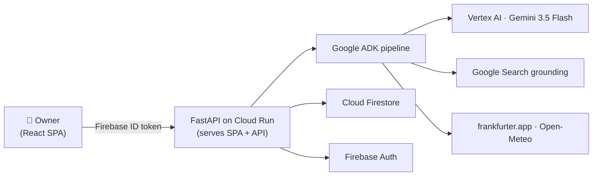
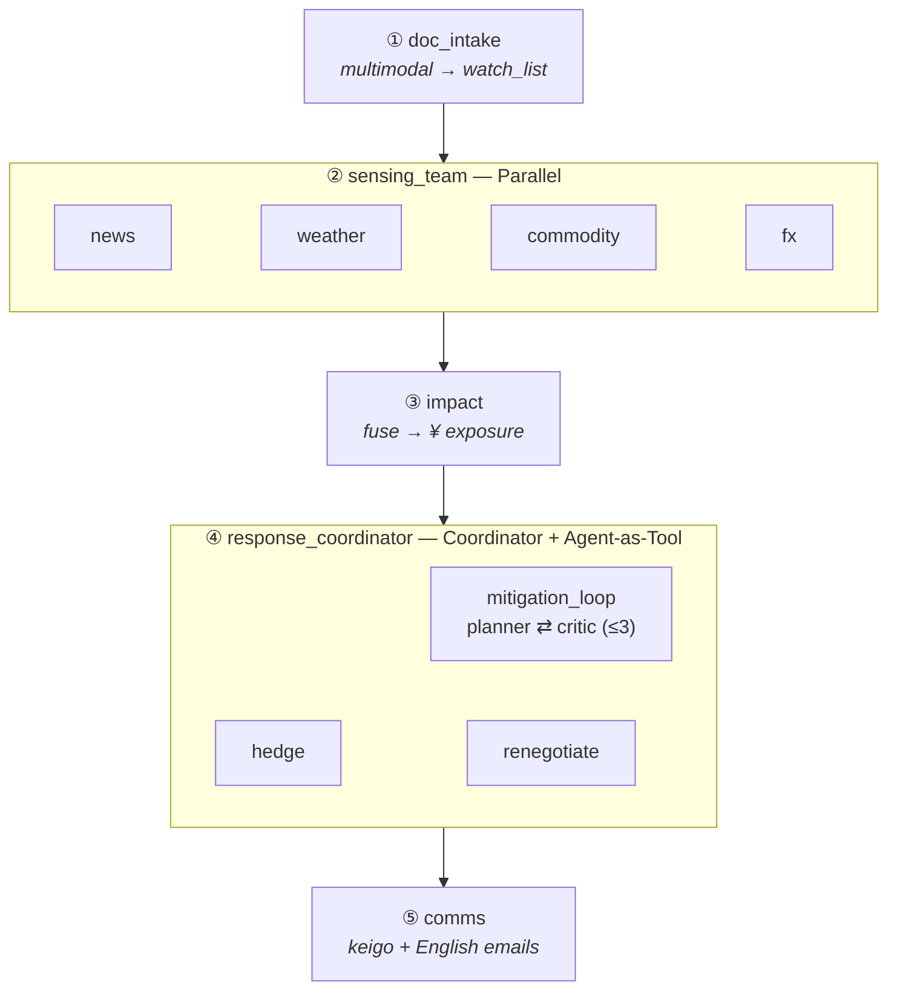

<div align="center">

# 🛰️ Sourcing Sentinel

**An always-on, multi-agent supply-chain risk radar for small Japanese manufacturers.**

Reads your messy paperwork → watches the world for threats to *your* parts → quantifies the
¥ exposure → plans a feasibility-checked response → drafts the emails to send.

Built end-to-end on the **Google Cloud / Gemini** agentic stack and deployed as a single
**Cloud Run** service in **Tokyo (asia-northeast1)**.

[**🔗 Live app**](https://sourcing-sentinel-h3rjzaz5ca-an.a.run.app) ·
[Architecture](docs/ARCHITECTURE.md) · [Case study](docs/CASESTUDY.md) · [Spec](docs/SPEC.md)

`Gemini 3.5 Flash` · `Agent Development Kit` · `Cloud Run` · `Firebase Auth` · `Firestore`

</div>

---

## The problem

Small and medium manufacturers are **99.7% of Japanese firms** — the *monozukuri* backbone —
yet they run lean: the owner is also the buyer and the bookkeeper, with parts often
**single-sourced** and priced in a volatile yen. A typhoon near one supplier, a 3% yen slide,
or an 8% titanium spike can erase a month's margin **before the owner even hears about it**.

They don't need another dashboard. They need a risk desk they can't afford to hire.

## What Sourcing Sentinel does

1. 📄 **Reads real paperwork (multimodal).** Upload a BOM / invoice (PDF, Excel, or a *photo*) and
   Gemini extracts a structured **watch list** — parts, suppliers, regions, currency, lead times.
2. 📡 **Watches four risk streams in parallel.** News, weather/logistics, commodity prices, and FX —
   each a focused agent, run concurrently.
3. 💴 **Fuses signals into *your* exposure.** Which parts/SKUs are at risk, by how many days, and the
   estimated **¥ at risk**.
4. 🔁 **Plans a feasible response.** A coordinator picks re-source / hedge / renegotiate and runs a
   **plan ⇄ critique loop** until the plan is actually feasible (rejects too-slow alternates).
5. ✉️ **Drafts ready-to-send emails** in correct **keigo (Japanese) + English** — to the incumbent
   supplier and to the chosen alternate.

> **Action, not anxiety.** Every run ends in a concrete, prioritized brief the owner can act on
> in the time it takes to read one screen.

---

## How it works



### The agent pipeline (5 ADK patterns)



| Pattern | Where | Why |
|---|---|---|
| **Sequential** | `root_agent` | each stage depends on prior state |
| **Parallel** | `sensing_team` | 4 independent streams at once |
| **Loop-Review** | `mitigation_loop` | planner proposes, critic rejects infeasible plans, repeat |
| **Coordinator** | `response_coordinator` | the situation chooses the response |
| **Agent-as-Tool** | specialists via `AgentTool` | coordinator stays in control |

> In a live run the critic rejected a 45-day alternate and the loop converged on a 12-day one —
> visible, self-correcting agent behavior, not a single prompt. Full diagrams + agent roster in
> [docs/ARCHITECTURE.md](docs/ARCHITECTURE.md).

---

## Google Cloud integration

| Product | How it's used |
|---|---|
| **Vertex AI — Gemini 3.5 Flash** | Reasoning engine for every agent + multimodal BOM/invoice parsing |
| **Agent Development Kit (ADK)** | Defines the agents and the five orchestration patterns; `Runner` + session state |
| **Google Search grounding** | Live, grounded news / commodity / supplier signals (built-in ADK tool) |
| **Cloud Run** | Hosts the whole app as one autoscaling service with a public URL (Tokyo) |
| **Cloud Build + Artifact Registry** | Builds & stores the container from source |
| **Firebase Authentication** | Owner sign-up / sign-in (email + Google); verified on every API call |
| **Cloud Firestore** | Per-user business profile + analysis history (named db `sourcingsentinel`) |

## Tech stack

| Area | Tech |
|---|---|
| Agents | **Google ADK** (`google-adk`) |
| Reasoning | **Vertex AI — Gemini 3.5 Flash** + Google Search grounding |
| Backend | **FastAPI** (serves the API *and* the built SPA) |
| Frontend | **React + Vite + TypeScript + Tailwind** |
| Auth / Data | **Firebase Authentication** · **Cloud Firestore** |
| Host | **Cloud Run** (single service, asia-northeast1) via **Cloud Build** + **Artifact Registry** |
| Free data | frankfurter.app (FX) · Open-Meteo (weather) — no API keys |

## Repository layout

```
sourcing_sentinel/   ADK agent package (agents/, tools/, schemas, config) + root_agent
backend/             FastAPI: main.py · runner.py (ADK Runner) · auth.py · store.py
frontend/            React + Vite SPA (auth, business profile, risk dashboard)
data/                Seed BOM + scripted demo trigger
Dockerfile           Multi-stage: build SPA → Python serves API + static
deploy.sh            One-command Cloud Run deploy (Tokyo)
docs/                ARCHITECTURE · SPEC · CASESTUDY · PLAN · GOALS_1..4
```

---

## Run locally

**Prerequisites:** Python 3.12+, Node 20+, the `gcloud` CLI, and a Google Cloud project with
Vertex AI enabled. Authenticate once: `gcloud auth application-default login`.

```bash
# 1) Agent pipeline (Python)
python -m venv .venv && source .venv/bin/activate
pip install -r requirements.txt
.venv/bin/python -m sourcing_sentinel.tests.test_pipeline   # full pipeline, real Gemini
.venv/bin/adk web sourcing_sentinel                          # ADK playground UI

# 2) Backend API
.venv/bin/uvicorn backend.main:app --port 8000 --reload     # /api/healthz · /api/analyze · /api/upload-bom

# 3) Frontend
cd frontend && npm install && npm run dev                    # http://localhost:5173
```

`.env` is preset for Vertex (`GOOGLE_GENAI_USE_VERTEXAI=TRUE`, project, `GOOGLE_CLOUD_LOCATION=asia-northeast1`).
Firebase one-time setup and the auth/Firestore flow are in [frontend/README.md](frontend/README.md).
`frontend/.env` `VITE_API_BASE` selects the backend: empty → built-in mock · `http://localhost:8000/api`
→ local backend · `…run.app/api` → deployed backend (current default).

## Deploy (one Cloud Run service, Tokyo)

```bash
./deploy.sh          # gcloud run deploy --source . --region asia-northeast1
```

**Prereqs:** enable `run`, `aiplatform`, `cloudbuild`, `artifactregistry`; grant the runtime
service account `roles/aiplatform.user` + `roles/datastore.user`; add the `*.run.app` domain to
Firebase **Authorized domains**. The Dockerfile builds the SPA with `VITE_API_BASE=/api`, so the
deployed app is same-origin (no CORS).

## Live vs. stubbed data

`USE_STUBS` (env) toggles the external data tools. The deployed service runs `USE_STUBS=true` for a
deterministic 2-minute demo; set `USE_STUBS=false` for live signals.

| Stream | `USE_STUBS=true` (demo) | `USE_STUBS=false` (live) |
|---|---|---|
| FX | canned USD/JPY +3% | **frankfurter.app** (no key) |
| Weather | canned typhoon near Kagoshima | **Open-Meteo** (no key) |
| Commodity | canned titanium +8% | Google Search grounding |
| Suppliers | 2 canned alternates | Google Search grounding + curated fallback |
| News | — | **Google Search** grounding (always live) |
| BOM parsing | returns `data/sample_bom.json` | **Gemini multimodal** on the uploaded file |

## Demo flow

> Sign up → **Business profile** → *Load sample BOM* (or upload a file) → **Save** →
> **Dashboard → Run analysis** → impacted parts + ¥ exposure, a feasibility-checked plan, and
> JP keigo + English draft emails. Each run is saved under `users/{uid}/runs`.

The seed scenario (`data/sample_bom.json` + `data/demo_trigger.json`) reproduces the
**Tanaka Seiko / titanium-bolt** story: a typhoon near Kagoshima + a titanium spike + a weak yen
flag the M3 titanium bolt across SKUs A-100/A-110/B-200/B-210, with a re-source + hedge plan.

---

## Honest limitations

- **Alternate-supplier data is the hardest input** — there's no free verified directory, so we use
  search grounding + a small curated fallback and never claim a verified DB.
- **Estimates, not guarantees** — ¥-exposure and delay figures are decision aids for a human; the
  system never acts on procurement autonomously (drafts only).
- **Signal quality varies** — news/commodity are noisier than FX/weather; the coordinator weighs,
  not blindly trusts, each stream.

## Project status

Built in four phases — agent core → frontend (auth + Firestore) → backend + deploy → end-to-end
wiring. All four are complete and the app is **live**. See [docs/GOALS_1.md](docs/GOALS_1.md)–[GOALS_4.md](docs/GOALS_4.md).

<div align="center">
<sub>Built for the Gemini AI Hackathon — Tokyo · localized for Japan's monozukuri SMEs.</sub>
</div>
