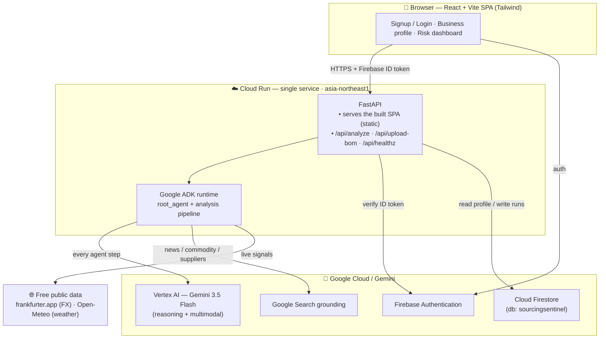
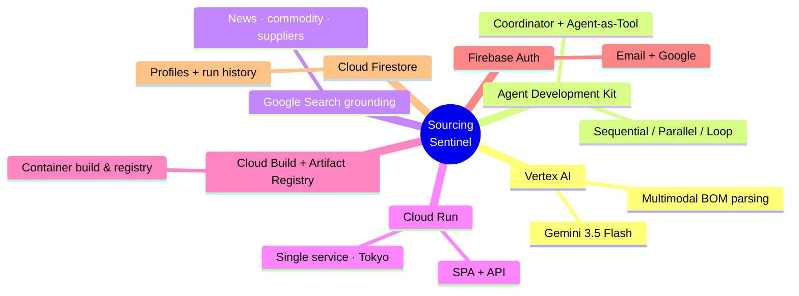
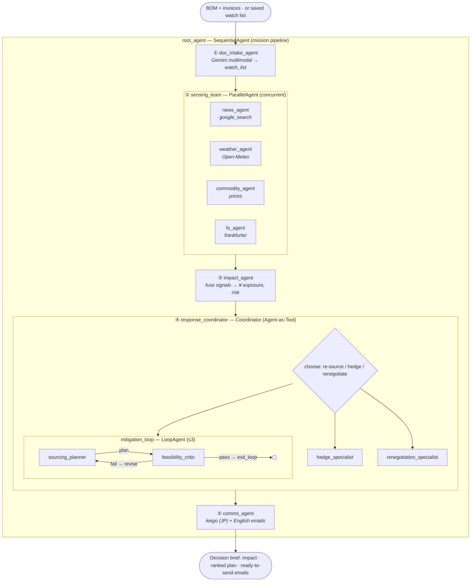
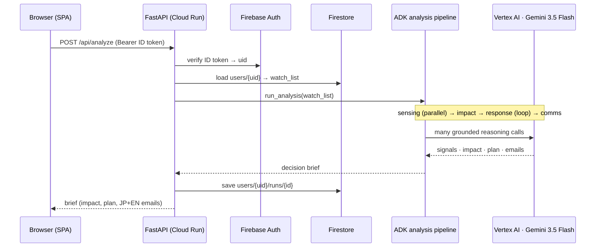
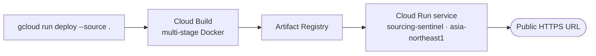

# Sourcing Sentinel — Architecture

> An always-on, multi-agent supply-chain risk radar for small Japanese manufacturers.
> Built entirely on the Google Cloud / Gemini agentic stack and deployed as a single
> **Cloud Run** service in **Tokyo (asia-northeast1)**.

**Live:** https://sourcing-sentinel-h3rjzaz5ca-an.a.run.app

---

## 1. System architecture (the big picture)



**Why one Cloud Run service?** The FastAPI backend serves *both* the API and the
pre-built SPA (static files with SPA fallback), so the entire product ships behind a
single public URL — satisfying the hackathon's "deployed on Google Cloud" requirement
with one artifact, one origin (no CORS in prod), and co-located with Vertex + Firestore
in Tokyo for low latency and data residency.

| Layer | Technology | Role |
|---|---|---|
| Frontend | React 19 + Vite + TypeScript + Tailwind | Signup, business/BOM profile, risk dashboard |
| Edge / host | **Cloud Run** (1 service, asia-northeast1) | Serves SPA + API; autoscaling, public URL |
| API | FastAPI (Python) | Auth, Firestore I/O, runs the agent pipeline |
| Agents | **Google ADK** (`google-adk`) | Orchestrates the multi-agent pipeline |
| Reasoning | **Vertex AI — Gemini 3.5 Flash** | Every agent's brain + multimodal doc parsing |
| Auth | **Firebase Authentication** | Email/password + Google sign-in |
| Data | **Cloud Firestore** (named db `sourcingsentinel`) | Per-user profile + analysis history |
| Build/ship | **Cloud Build** + **Artifact Registry** | Container build + image registry |

---

## 2. Google products used (judging: Google Cloud integration)



| Google product | How Sourcing Sentinel uses it |
|---|---|
| **Vertex AI (Gemini 3.5 Flash)** | The reasoning engine for *all* agents, and the multimodal model that reads messy BOM/invoice files (PDF, Excel, photo) into a structured watch list. Runs in `asia-northeast1`. |
| **Agent Development Kit (ADK)** | Defines the agents and wires the five orchestration patterns (Sequential, Parallel, Loop, Coordinator, Agent-as-Tool). Provides the `Runner`, session state, and tool calling. |
| **Google Search grounding** | Built-in ADK tool used by the news agent (and available to commodity/supplier discovery) for live, grounded signals instead of hallucinated ones. |
| **Cloud Run** | Hosts the entire app as one autoscaling service with a public HTTPS URL. |
| **Cloud Build + Artifact Registry** | `gcloud run deploy --source .` builds the multi-stage Docker image and stores it. |
| **Firebase Authentication** | Owner sign-up / sign-in (email + Google); the backend verifies the Firebase ID token on every API call. |
| **Cloud Firestore** | Stores each owner's business profile + BOM watch list and a history of analysis runs, in the named `sourcingsentinel` database (Tokyo). |

---

## 3. Core agent architecture (the heart of the system)

A **Sequential** mission pipeline is the spine. Stage 2 fans out in **Parallel**.
Stage 4 is a **Coordinator** that drives a **Loop-Review** and specialists exposed as
**Agent-as-Tools**. All five canonical multi-agent patterns appear.



### Agent roster

| # | Agent | ADK type | Reads (state) | Writes `output_key` | Tools |
|---|---|---|---|---|---|
| 1 | `doc_intake_agent` | LlmAgent | user message / files | `watch_list` | `parse_documents` (Gemini multimodal) |
| 2 | `news_agent` | LlmAgent | `watch_list` | `news_risk` | `google_search` |
| 2 | `weather_agent` | LlmAgent | `watch_list` | `weather_risk` | `get_weather_logistics` (Open-Meteo) |
| 2 | `commodity_agent` | LlmAgent | `watch_list` | `commodity_risk` | `get_commodity_prices` |
| 2 | `fx_agent` | LlmAgent | `watch_list` | `fx_risk` | `get_fx` (frankfurter.app) |
| 2 | `sensing_team` | **ParallelAgent** | — | — | runs the 4 above concurrently |
| 3 | `impact_agent` | LlmAgent | `watch_list` + 4×`*_risk` | `impact` | — |
| 4 | `sourcing_planner` | LlmAgent | `impact`, `feasibility?` | `sourcing_plan` | `find_alternate_suppliers` |
| 4 | `feasibility_critic` | LlmAgent | `sourcing_plan`, `impact` | `feasibility` | `exit_loop` |
| 4 | `mitigation_loop` | **LoopAgent** (≤3) | — | — | planner ⇄ critic |
| 4 | `hedge_specialist` | LlmAgent | `impact` | `hedge_plan` | — |
| 4 | `renegotiation_specialist` | LlmAgent | `impact` | `reneg_plan` | — |
| 4 | `response_coordinator` | **LlmAgent (Coordinator)** | `impact` | `response_plan` | `AgentTool`(loop, hedge, reneg) |
| 5 | `comms_agent` | LlmAgent | `impact`, `response_plan` | final emails | — |

### The five agent patterns (one slide)

| Pattern | Where | Why it matters |
|---|---|---|
| **Sequential** | `root_agent` | Each stage depends on the previous one's state. |
| **Parallel** | `sensing_team` | 4 independent risk streams run at once — faster, isolated context. |
| **Loop-Review** | `mitigation_loop` | Planner proposes, critic rejects infeasible alternates, repeat until feasible. |
| **Coordinator** | `response_coordinator` | The situation decides the response: re-source, hedge, or renegotiate. |
| **Agent-as-Tool** | specialists via `AgentTool` | Coordinator stays in control instead of blindly transferring. |

> **Demo proof point:** in a live run, the critic rejected a 45-day alternate and the
> loop converged on a 12-day one — visible, self-correcting agent behavior, not a single prompt.

---

## 4. Request lifecycle — "Run analysis"



**Note on intake vs. analysis:** the full `root_agent` (with `doc_intake_agent`) powers
`adk run`/`adk web` and the BOM-upload flow. For `/api/analyze`, the backend runs an
**analysis pipeline** (sensing → impact → response → comms) and injects the user's saved
`watch_list` straight into session state — no need to re-parse documents every run.

---

## 5. Data model (Firestore — `sourcingsentinel`)

```
users/{uid}                     ← business profile
  ├─ company_name, contact_*, currency_home
  └─ items: [ WatchListItem … ] ← the BOM watch list
users/{uid}/runs/{runId}        ← one analysis result (Brief)
  ├─ impact { items[], overall_risk, summary }
  ├─ response_plan { priority_actions[], chosen[], summary }
  └─ emails [ { to, lang: JP|EN, subject, body } ]
```

Security rules scope every user to their own `users/{uid}/**` — no cross-user access.

### State Contract (how agents pass data)

`watch_list` → `news_risk` · `weather_risk` · `commodity_risk` · `fx_risk` → `impact`
→ (`sourcing_plan` · `feasibility` · `hedge_plan` · `reneg_plan`) → `response_plan` →
emails. Each agent reads/writes only these `session.state` keys.

---

## 6. Deployment topology



- **Multi-stage image:** Node stage builds the SPA (`VITE_API_BASE=/api`) → Python stage
  serves API + static via Uvicorn.
- **Region:** everything (Cloud Run, Vertex, Firestore) in **asia-northeast1**.
- **Config:** `USE_STUBS=true` for a deterministic demo; flip to `false` for live
  FX/weather/search. Model pinned to `gemini-3.5-flash`.

---

## 7. Pitch-deck talking points

- **Real problem, local fit:** 99.7% of Japanese firms are SMEs; single-sourced,
  yen-exposed, no risk desk. We give them one — as a team of AI agents.
- **Multimodal in, action out:** upload messy BOM/invoices → get ¥-quantified risk,
  a feasibility-checked plan, and ready-to-send **keigo + English** emails.
- **Genuinely agentic:** five ADK patterns, parallel sensing, and a self-correcting
  plan⇄critique loop — orchestration, not a single prompt.
- **All-Google, all-Tokyo:** Gemini 3.5 Flash + ADK + Cloud Run + Firebase + Firestore,
  one service, one region, one public URL.
